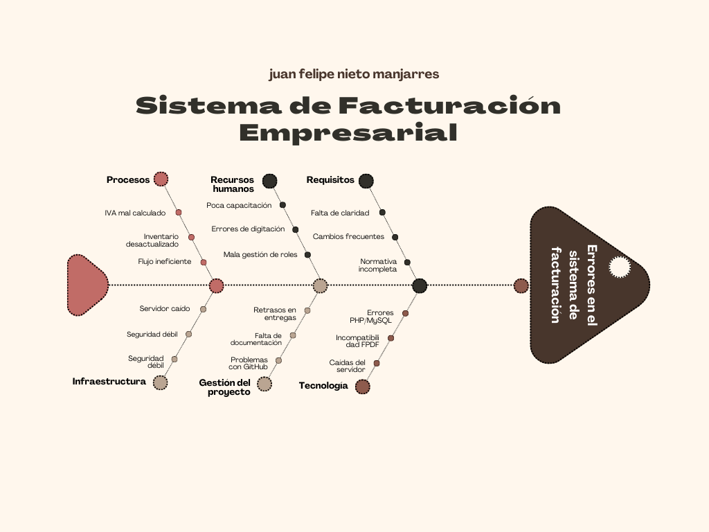

# propuesta-proyecto-grado
# Sistema de Facturación Empresarial

## Descripción
Este proyecto corresponde a una propuesta de grado orientada al desarrollo de un sistema de facturación empresarial.  
El sistema busca brindar a las pequeñas y medianas empresas una solución para gestionar clientes, productos, facturas e inventario, con generación de reportes y exportación en PDF.

---

## Objetivos

### Objetivo general
Desarrollar un sistema de facturación empresarial que permita a las empresas gestionar ventas, clientes, inventario y reportes de manera eficiente.

### Objetivos específicos
- Diseñar una base de datos en MySQL para almacenar facturas, clientes, productos e impuestos.  
- Implementar un módulo de autenticación de usuarios con roles (administrador, vendedor, contador).  
- Desarrollar la interfaz de facturación con cálculo automático de IVA y descuentos.  
- Generar reportes en PDF/Excel de ventas por rango de fechas.  
- Implementar un panel de administración con métricas visuales (ej. ventas diarias, productos más vendidos).  

---

## Alcance
- Registro de clientes y productos.  
- Emisión de facturas con impuestos.  
- Control básico de inventario.  
- Generación de reportes en PDF/Excel.  
- Panel de administración con métricas.  

*(Trabajo futuro: integración con facturación electrónica DIAN)*  

---

## Tecnologías a utilizar
- Backend: PHP + MySQL  
- Frontend: HTML, CSS, Bootstrap, JavaScript.  
- Base de datos: MySQL.  
- Reportes: Generación de PDF con la librería FPDF en PHP.
- Control de versiones: GitHub.  

---

## Metodología
1. Fase 1 – Análisis: Levantamiento de requisitos.  
2. Fase 2 – Diseño: Diagramas UML, diseño de base de datos.  
3. Fase 3 – Implementación: Desarrollo backend, frontend y conexión a la BD.  
4. Fase 4 – Pruebas: Unitarias y de integración.  
5. Fase 5 – Documentación y despliegue en GitHub.  

---

## Resultados esperados
- Un sistema de facturación funcional y modular.  
- Código abierto y documentado en GitHub.  
- Documentación con manual de usuario y manual técnico.  

---
## Diagrama de Ishikawa

---
## Historias de Usuario 

---

## 1
**Descripción:**  
Como **administrador** quiero registrar clientes en el sistema para poder mantener organizada la información de mis compradores.  

**Criterios de validación:**  
- [ ] Registrar nuevos clientes  
- [ ] Verificar que los datos queden guardados en la BD  
- [ ] Editar y eliminar clientes  

**Valor:** `200`  
**Prioridad:** `1`  
**Estimación:** `12h`  

---

## 2
**Descripción:**  
Como **administrador** quiero dar de alta productos con precios e impuestos para poder facturarlos correctamente.  

**Criterios de validación:**  
- [ ] Registrar productos con precio, IVA y stock  
- [ ] Verificar que aparezcan en inventario  
- [ ] Permitir actualización de stock y precio  

**Valor:** `220`  
**Prioridad:** `1`  
**Estimación:** `14h`  

---

## 3
**Descripción:**  
Como **vendedor** quiero emitir facturas con IVA y descuentos para poder entregar comprobantes legales a mis clientes.  

**Criterios de validación:**  
- [ ] Generar factura con productos y cantidades  
- [ ] Calcular IVA y descuentos automáticamente  
- [ ] Guardar factura en la BD  

**Valor:** `300`  
**Prioridad:** `1`  
**Estimación:** `18h`  

---

## 4
**Descripción:**  
Como **vendedor** quiero exportar las facturas en formato PDF para poder entregarlas digitalmente a los clientes.  

**Criterios de validación:**  
- [ ] Descargar PDF con logo de la empresa  
- [ ] Mostrar fecha, productos, valores e impuestos  
- [ ] Guardar copia en el servidor  

**Valor:** `250`  
**Prioridad:** `2`  
**Estimación:** `10h`  

---

## 5
**Descripción:**  
Como **administrador** quiero generar reportes de ventas por rango de fechas para poder analizar el rendimiento del negocio.  

**Criterios de validación:**  
- [ ] Seleccionar fechas de inicio y fin  
- [ ] Mostrar ventas totales y número de facturas  
- [ ] Exportar a PDF y Excel  

**Valor:** `280`  
**Prioridad:** `2`  
**Estimación:** `16h`  

---

## 6
**Descripción:**  
Como **administrador** quiero llevar un control del inventario para poder saber qué productos están disponibles.  

**Criterios de validación:**  
- [ ] Descontar stock al emitir factura  
- [ ] Mostrar productos con bajo inventario  
- [ ] Permitir actualización manual de stock  

**Valor:** `300`  
**Prioridad:** `1`  
**Estimación:** `20h`  

---

## 7
**Descripción:**  
Como **administrador** quiero tener un sistema de inicio de sesión con roles para poder controlar el acceso según permisos (admin, vendedor, contador).  

**Criterios de validación:**  
- [ ] Login con usuario y contraseña  
- [ ] Acceso restringido según rol  
- [ ] Logout seguro  

**Valor:** `350`  
**Prioridad:** `1`  
**Estimación:** `22h`  

---

## 8
**Descripción:**  
Como **administrador** quiero un panel con métricas visuales para poder ver rápidamente el estado de ventas e inventario.  

**Criterios de validación:**  
- [ ] Mostrar ventas diarias  
- [ ] Mostrar productos más vendidos  
- [ ] Visualización en gráficas  

**Valor:** `280`  
**Prioridad:** `2`  
**Estimación:** `18h`  

---

## 9
**Descripción:**  
Como **vendedor** quiero actualizar datos de clientes para poder mantener su información al día.  

**Criterios de validación:**  
- [ ] Editar nombre, dirección, contacto  
- [ ] Validar que los cambios se reflejen en facturas futuras  
- [ ] Guardar historial de modificaciones  

**Valor:** `200`  
**Prioridad:** `3`  
**Estimación:** `8h`  

---

## 10
**Descripción:**  
Como **administrador** quiero generar copias de respaldo de la base de datos para poder recuperar información en caso de pérdida.  

**Criterios de validación:**  
- [ ] Exportar BD en archivo SQL  
- [ ] Permitir restaurar copia  
- [ ] Programar respaldo automático  

**Valor:** `400`  
**Prioridad:** `3`  
**Estimación:** `24h`  

---

## Autor
- Juan Felipe Nieto Manjarres  
  

