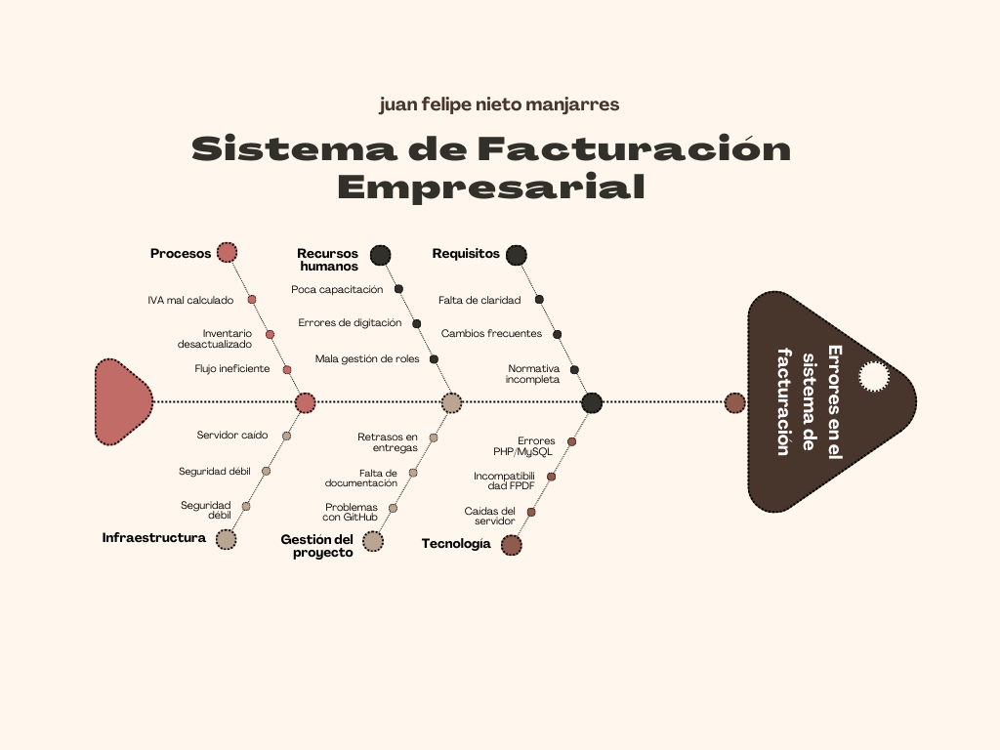

# Validación y Verificación del Proyecto  
### Sistema de Facturación Empresarial  
 

---

## 1. Introducción

Este documento presenta las actividades de **validación y verificación (V&V)** aplicadas al proyecto **Sistema de Facturación Empresarial**.  
El propósito es garantizar que el sistema cumpla con las necesidades del usuario y con los requisitos técnicos establecidos.

- **Validación:** Determina si el sistema satisface las necesidades del usuario final.  
- **Verificación:** Evalúa si el sistema se construye correctamente conforme a las especificaciones y estándares de diseño.

---

## 2. Objetivos de la V&V

- Asegurar la coherencia, completitud y corrección de los requisitos.  
- Confirmar que cada componente cumple con su diseño y funcionalidad esperada.  
- Detectar y corregir errores antes del desarrollo final.  
- Establecer trazabilidad entre requisitos, casos de uso y pruebas.

---

## 3. Alcance de la Validación y Verificación

| Etapa del Proyecto | Tipo de Actividad | Descripción |
|--------------------|------------------|--------------|
| Análisis | Validación | Revisión de requisitos e historias de usuario con el cliente. |
| Diseño | Verificación | Análisis de consistencia de diagramas UML y estructura de base de datos. |
| Implementación | Verificación | Pruebas unitarias y de integración del código. |
| Pruebas | Validación | Pruebas de aceptación de usuario y simulación de uso real. |
| Documentación | Verificación | Revisión de manuales técnico y de usuario. |

---

## 4. Casos de Uso Identificados

| ID | Nombre del Caso de Uso | Actor Principal | Descripción | Tipo (Validar/Verificar) |
|----|------------------------|-----------------|--------------|---------------------------|
| CU01 | Registrar cliente | Administrador | Permite registrar y administrar clientes. | Validar |
| CU02 | Registrar producto | Administrador | Crea productos con precio, IVA y stock. | Verificar |
| CU03 | Emitir factura | Vendedor | Genera facturas con cálculo automático de IVA y descuentos. | Validar |
| CU04 | Exportar factura a PDF | Vendedor | Exporta la factura a formato PDF con logo e información completa. | Verificar |
| CU05 | Generar reportes | Administrador | Obtiene reportes de ventas por rango de fechas en PDF/Excel. | Validar |
| CU06 | Control de inventario | Administrador | Actualiza el stock al facturar y muestra productos con bajo inventario. | Verificar |
| CU07 | Sistema de autenticación y roles | Todos | Controla el acceso según rol (admin, vendedor, contador). | Verificar |
| CU08 | Panel de métricas | Administrador | Muestra gráficas de ventas diarias y productos más vendidos. | Validar |

---

## 5. Tabla de Trazabilidad

| Requisito | Caso de Uso Relacionado | Prueba Asociada | Estado Esperado |
|------------|------------------------|-----------------|-----------------|
| RQ01 - Registrar clientes | CU01 | Prueba de inserción en BD | Cliente registrado correctamente |
| RQ02 - Gestión de productos | CU02 | Prueba de validación de campos y stock | Producto creado y listado |
| RQ03 - Facturación | CU03 | Prueba de cálculo de IVA y total | Factura generada correctamente |
| RQ04 - Exportar factura | CU04 | Prueba de generación de PDF | Archivo PDF descargado |
| RQ05 - Reportes | CU05 | Prueba de rango de fechas | Reporte mostrado correctamente |
| RQ06 - Control de inventario | CU06 | Prueba de stock descontado | Stock actualizado |
| RQ07 - Autenticación | CU07 | Prueba de inicio y cierre de sesión | Acceso permitido/denegado |
| RQ08 - Panel de métricas | CU08 | Prueba de visualización gráfica | Datos representados correctamente |

---

## 6. Actividades de Validación

1. Revisión de requisitos con el cliente.  
2. Validación de flujos mediante prototipos o mockups.  
3. Evaluación de consistencia de historias de usuario.  
4. Simulación de escenarios de facturación, inventario y reportes.  

---

## 7. Actividades de Verificación

1. Revisión técnica de diseño y base de datos.  
2. Validación de formato y coherencia de reportes.  
3. Pruebas unitarias en módulos de facturación, login e inventario.  
4. Revisión de seguridad en contraseñas y roles.  
5. Validación del funcionamiento de exportación PDF/Excel.  

---

## 8. Resultados Esperados

- Cada historia de usuario cumple con sus criterios de validación.  
- Los módulos principales funcionan sin errores críticos.  
- Los reportes y métricas reflejan datos reales del sistema.  
- El código cumple buenas prácticas de programación.  
- Documentación técnica y manual de usuario verificados.  

---

## 9. Conclusión

La aplicación de validación y verificación permitirá reducir errores antes de la implementación final del sistema y asegurar que el producto cumpla con las expectativas del cliente y los objetivos definidos en la propuesta original.  

---

## 10. Archivos Relacionados

- `/diagrams/usecase_diagram.png` — Diagrama de Casos de Uso  
- `/docs/validation_verification.md` — Documento actual  
- `/tests/unit/` — Carpeta para pruebas unitarias  
- `/tests/integration/` — Carpeta para pruebas de integración  

---

**Autor:** Juan Felipe Nieto Manjarres  

  

# propuesta-proyecto-grado
# Sistema de Facturación Empresarial

## Descripción
Este proyecto corresponde a una propuesta de grado orientada al desarrollo de un sistema de facturación empresarial.  
El sistema busca brindar a las pequeñas y medianas empresas una solución para gestionar clientes, productos, facturas e inventario, con generación de reportes y exportación en PDF.

---

## Objetivos

### Objetivo general
Desarrollar un sistema de facturación empresarial que permita a las empresas gestionar ventas, clientes, inventario y reportes de manera eficiente.

### Objetivos específicos
- Diseñar una base de datos en MySQL para almacenar facturas, clientes, productos e impuestos.  
- Implementar un módulo de autenticación de usuarios con roles (administrador, vendedor, contador).  
- Desarrollar la interfaz de facturación con cálculo automático de IVA y descuentos.  
- Generar reportes en PDF/Excel de ventas por rango de fechas.  
- Implementar un panel de administración con métricas visuales (ej. ventas diarias, productos más vendidos).  

---

## Alcance
- Registro de clientes y productos.  
- Emisión de facturas con impuestos.  
- Control básico de inventario.  
- Generación de reportes en PDF/Excel.  
- Panel de administración con métricas.  

*(Trabajo futuro: integración con facturación electrónica DIAN)*  

---

## Tecnologías a utilizar
- Backend: PHP + MySQL  
- Frontend: HTML, CSS, Bootstrap, JavaScript.  
- Base de datos: MySQL.  
- Reportes: Generación de PDF con la librería FPDF en PHP.
- Control de versiones: GitHub.  

---

## Metodología
1. Fase 1 – Análisis: Levantamiento de requisitos.  
2. Fase 2 – Diseño: Diagramas UML, diseño de base de datos.  
3. Fase 3 – Implementación: Desarrollo backend, frontend y conexión a la BD.  
4. Fase 4 – Pruebas: Unitarias y de integración.  
5. Fase 5 – Documentación y despliegue en GitHub.  

---

## Resultados esperados
- Un sistema de facturación funcional y modular.  
- Código abierto y documentado en GitHub.  
- Documentación con manual de usuario y manual técnico.  

---
## Diagrama de Ishikawa

---
## Historias de Usuario 

---

## 1
**Descripción:**  
Como **administrador** quiero registrar clientes en el sistema para poder mantener organizada la información de mis compradores.  

**Criterios de validación:**  
- [ ] Registrar nuevos clientes  
- [ ] Verificar que los datos queden guardados en la BD  
- [ ] Editar y eliminar clientes  

**Valor:** `200`  
**Prioridad:** `1`  
**Estimación:** `12h`  

---

## 2
**Descripción:**  
Como **administrador** quiero dar de alta productos con precios e impuestos para poder facturarlos correctamente.  

**Criterios de validación:**  
- [ ] Registrar productos con precio, IVA y stock  
- [ ] Verificar que aparezcan en inventario  
- [ ] Permitir actualización de stock y precio  

**Valor:** `220`  
**Prioridad:** `1`  
**Estimación:** `14h`  

---

## 3
**Descripción:**  
Como **vendedor** quiero emitir facturas con IVA y descuentos para poder entregar comprobantes legales a mis clientes.  

**Criterios de validación:**  
- [ ] Generar factura con productos y cantidades  
- [ ] Calcular IVA y descuentos automáticamente  
- [ ] Guardar factura en la BD  

**Valor:** `300`  
**Prioridad:** `1`  
**Estimación:** `18h`  

---

## 4
**Descripción:**  
Como **vendedor** quiero exportar las facturas en formato PDF para poder entregarlas digitalmente a los clientes.  

**Criterios de validación:**  
- [ ] Descargar PDF con logo de la empresa  
- [ ] Mostrar fecha, productos, valores e impuestos  
- [ ] Guardar copia en el servidor  

**Valor:** `250`  
**Prioridad:** `2`  
**Estimación:** `10h`  

---

## 5
**Descripción:**  
Como **administrador** quiero generar reportes de ventas por rango de fechas para poder analizar el rendimiento del negocio.  

**Criterios de validación:**  
- [ ] Seleccionar fechas de inicio y fin  
- [ ] Mostrar ventas totales y número de facturas  
- [ ] Exportar a PDF y Excel  

**Valor:** `280`  
**Prioridad:** `2`  
**Estimación:** `16h`  

---

## 6
**Descripción:**  
Como **administrador** quiero llevar un control del inventario para poder saber qué productos están disponibles.  

**Criterios de validación:**  
- [ ] Descontar stock al emitir factura  
- [ ] Mostrar productos con bajo inventario  
- [ ] Permitir actualización manual de stock  

**Valor:** `300`  
**Prioridad:** `1`  
**Estimación:** `20h`  

---

## 7
**Descripción:**  
Como **administrador** quiero tener un sistema de inicio de sesión con roles para poder controlar el acceso según permisos (admin, vendedor, contador).  

**Criterios de validación:**  
- [ ] Login con usuario y contraseña  
- [ ] Acceso restringido según rol  
- [ ] Logout seguro  

**Valor:** `350`  
**Prioridad:** `1`  
**Estimación:** `22h`  

---

## 8
**Descripción:**  
Como **administrador** quiero un panel con métricas visuales para poder ver rápidamente el estado de ventas e inventario.  

**Criterios de validación:**  
- [ ] Mostrar ventas diarias  
- [ ] Mostrar productos más vendidos  
- [ ] Visualización en gráficas  

**Valor:** `280`  
**Prioridad:** `2`  
**Estimación:** `18h`  

---

## 9
**Descripción:**  
Como **vendedor** quiero actualizar datos de clientes para poder mantener su información al día.  

**Criterios de validación:**  
- [ ] Editar nombre, dirección, contacto  
- [ ] Validar que los cambios se reflejen en facturas futuras  
- [ ] Guardar historial de modificaciones  

**Valor:** `200`  
**Prioridad:** `3`  
**Estimación:** `8h`  

---

## 10
**Descripción:**  
Como **administrador** quiero generar copias de respaldo de la base de datos para poder recuperar información en caso de pérdida.  

**Criterios de validación:**  
- [ ] Exportar BD en archivo SQL  
- [ ] Permitir restaurar copia  
- [ ] Programar respaldo automático  

**Valor:** `400`  
**Prioridad:** `3`  
**Estimación:** `24h`  

---

## Autor
- Juan Felipe Nieto Manjarres  
